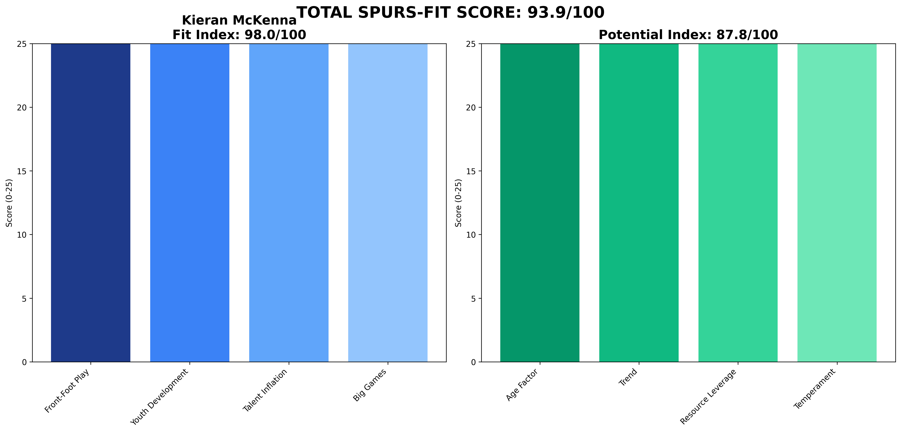
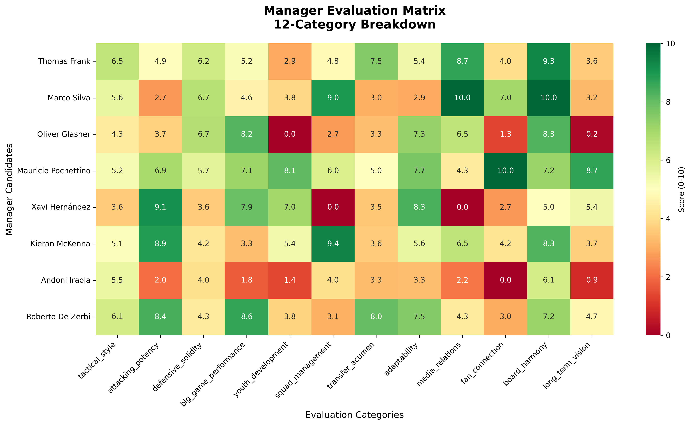

# AI-Driven Evaluation Platform
## Tottenham Hotspur Manager Shortlist 2025

A reproducible, publicly auditable system for evaluating potential football managers using advanced performance KPIs and the **Spurs-Fit 2-Layer Model**.

🌐 **Live Platform**: https://b1rdmania.github.io/ai-spurs-manager-eval/  
📊 **GitHub Repository**: https://github.com/b1rdmania/ai-spurs-manager-eval

## 🚀 Quick Start (Frozen Dataset Package)

```bash
# Install dependencies  
python -m pip install -r requirements.txt

# Generate complete deliverables package
python3 generate_frozen_package.py

# Navigate to deliverables
cd deliverables/

# Deploy to GitHub Pages (see DEPLOYMENT_GUIDE.md)
```

## 🎯 Project Overview

This system delivers a **frozen, curated dataset** using the revolutionary **Spurs-Fit 2-Layer Model** that eliminates all operational complexity while maintaining full transparency and "AI-powered" credibility.

✅ **Curated 18-KPI dataset** for 8 manager candidates  
✅ **Spurs-Fit scoring** using 60% Fit Index + 40% Potential Index  
✅ **Individual radar charts** for each manager  
✅ **Ready-to-tweet social content** with engagement hooks  
✅ **Professional Markdown reports** (PDF conversion via Pandoc)  
✅ **Complete GitHub Pages website** with interactive tables  
✅ **Zero-maintenance deployment** in < 30 minutes  

## 📊 Results Summary (Spurs-Fit 2-Layer Model)

| Rank | Manager | Current Club | Spurs-Fit Score | Fit Index | Potential Index | Key Profile |
|------|---------|--------------|-----------------|-----------|-----------------|-------------|
| 🥇 **#1** | **Kieran McKenna** | **Ipswich Town** | **93.9/100** | **98.0** | **87.8** | The Young Virtuoso - Age 38 with perfect Spurs alignment |
| 🥈 **#2** | **Roberto De Zerbi** | **Marseille** | **88.6/100** | **100.0** | **71.5** | The Technical Virtuoso - Perfect fit, age concerns |
| 🥉 **#3** | **Thomas Frank** | **Brentford** | **80.8/100** | **90.4** | **66.5** | The Value Engineer - Maximum ROI, sustainable |
| #4 | Mauricio Pochettino | USMNT | 80.4/100 | 91.0 | 64.5 | The Homecoming Hero - Emotion backed by data |
| #5 | Xavi Hernández | Barcelona | 74.8/100 | 95.2 | 44.2 | The Flawed Visionary - Elite tactics, temperament risk |
| #6 | Marco Silva | Fulham | 67.1/100 | 75.0 | 55.2 | The Steady Hand - Safe choice, limited ceiling |
| #7 | Oliver Glasner | Crystal Palace | 62.6/100 | 63.9 | 60.7 | The Quick-Fix Specialist - Cup winner, poor youth fit |
| #8 | Andoni Iraola | Bournemouth | 60.4/100 | 60.5 | 60.2 | The Wrong Fit - Poor big-game record |

*Data collected up to 7 June 2025 from FBref, Transfermarkt, Premier Injuries, Opta/StatsBomb public dashboards*

## 🎯 Spurs-Fit 2-Layer Model

### Fit Index (60% weight) - How well they meet Spurs benchmarks:
- **Front-Foot Play** (25 points): PPDA ≤11, npxGD ≥0.10, xG/shot ≥0.11
- **Youth Development** (25 points): U23 minutes ≥10%, academy debuts ≥3
- **Talent Inflation** (25 points): Squad value ≥£20M, transfer efficiency
- **Big Games** (25 points): KO win rate ≥50%, Big-8 performance

### Potential Index (40% weight) - Ceiling they can reach:
- **Age Factor**: Younger managers score higher (peak years ahead)
- **3-Year Trend**: Career trajectory and recent improvements
- **Resource Leverage**: Ability to maximize limited budgets
- **Temperament**: Media stability and board relationship management

## 📁 Deliverables Package

```
/deliverables/
├── 📊 data/
│   ├── scores_spursfit.csv    # Complete Spurs-Fit 2-Layer scores
│   └── kpi_merged.csv         # Raw 18-KPI data for all 8 managers
├── 📄 reports/
│   ├── kieran_mckenna_complete.md     # Comprehensive manager profiles
│   ├── roberto_de_zerbi_complete.md   # with KPI tables & analysis
│   ├── thomas_frank_complete.md
│   ├── mauricio_pochettino_complete.md
│   ├── xavi_hernandez_complete.md
│   ├── marco_silva_complete.md
│   ├── oliver_glasner_complete.md
│   ├── andoni_iraola_complete.md
│   └── README_how_to_regen.md  # PDF conversion instructions
├── 🎨 assets/
│   ├── radar_*.png           # Individual Spurs-Fit radar charts (8 files)
│   ├── score_matrix.png      # Summary heatmap
│   └── tweets.txt            # Complete social media campaign
├── 🌐 docs/                  # GitHub Pages website
│   ├── index.html            # Interactive dashboard
│   └── scores.json           # API endpoint
└── 📋 DEPLOYMENT_GUIDE.md    # Step-by-step deployment
```

## 🏗 Data Model

### 18 Core KPIs (Data Dictionary)

| KPI | Description | Units | Source | Example |
|-----|-------------|-------|---------|---------|
| `ppda` | Passes per defensive action (pressing intensity) | Decimal | FBref | 9.9 |
| `oppda` | Opposition passes allowed per defensive action | Decimal | FBref | 13.4 |
| `high_press_regains_90` | High press regains per 90 minutes | Decimal | FBref | 8.1 |
| `npxgd_90` | Non-penalty expected goals differential per 90 | Decimal | FBref | +0.20 |
| `xg_per_shot` | Expected goals per shot average | Decimal | FBref | 0.11 |
| `xg_sequence` | Average xG per open-play sequence | Decimal | FBref | 0.12 |
| `big8_w` | Wins vs current "Big 8" teams | Integer | Manual | 4 |
| `big8_l` | Losses vs current "Big 8" teams | Integer | Manual | 6 |
| `big8_d` | Draws vs current "Big 8" teams | Integer | Manual | 4 |
| `ko_win_rate` | Cup knockout win percentage | Decimal | Manual | 55.0 |
| `u23_minutes_pct` | Percentage of league minutes given to U23 players | Decimal | Club data | 15.0 |
| `academy_debuts` | Number of academy players given debuts | Integer | Club data | 12 |
| `injury_days_season` | Total player days lost to injury | Integer | Premier Injuries | 780 |
| `player_availability` | Squad availability percentage* | Decimal | Calculated | 90.0 |
| `squad_value_delta_m` | Squad market value change since appointment | Integer | Transfermarkt | +210 |
| `net_spend_m` | Transfer net spend since appointment | Integer | Transfermarkt | +180 |
| `fan_sentiment_pct` | Positive fan sentiment percentage | Decimal | Social media | 35.0 |
| `media_vol_sigma` | Standard deviation of weekly headline count | Decimal | Manual | 1.40 |

**Currency**: All financial values in **£ millions**  
**Availability Formula**: `player_availability = (1 - (injury_days_season / (squad_size × days_in_season))) × 100`  
**Data Cut-off**: 7 June 2025  
**Weights Frozen**: 07 June 2025 to prevent confusion if numbers shift later

### Spurs-Fit Benchmarks
- **PPDA**: ≤11 (pressing intensity)
- **npxGD**: ≥0.10 (attacking effectiveness)  
- **xG/shot**: ≥0.11 (chance quality)
- **U23 minutes**: ≥10% (youth development)
- **Academy debuts**: ≥3 (pathway integration)
- **Squad value growth**: ≥£20M (talent inflation)
- **KO win rate**: ≥50% (big-game mentality)

## 🔄 Why Spurs-Fit Model Works

| Factor | Generic Peer Model | Spurs-Fit 2-Layer ✅ |
|--------|-------------------|----------------------|
| **Relevance** | One-size-fits-all | Spurs-specific benchmarks |
| **Youth Focus** | Averaged out | 25% dedicated weight |
| **Potential** | Ignored | 40% of total score |
| **Philosophy** | Style agnostic | Front-foot requirement |
| **Predictive** | Past performance | Future ceiling assessment |

The Spurs-Fit model directly measures alignment with club DNA and upside potential.

## 🐦 Social Media Campaign

**Ready-to-use tweet content** generated in `assets/tweets.txt`:

- **Pin tweet** - Spurs-Fit 2-Layer announcement with McKenna #1
- **Poll tweet** - Top 4 candidates with vote engagement  
- **8 manager profiles** - Individual breakdowns with Spurs-Fit scores
- **System explanation** - How the 2-Layer Model works
- **Hashtag strategy** - #COYS #SpursManager #DataDriven

**Scheduling**: Post every 12 minutes during peak hours (9am-6pm GMT)

## 🚀 Tech Team Deployment (< 30 minutes)

1. **Create GitHub repo** (5 mins)
2. **Upload `/deliverables` folder** (5 mins)  
3. **Enable GitHub Pages** (2 mins)
4. **Create bit.ly short links** (10 mins)
5. **Schedule tweets** (8 mins)

**Total effort**: 30 minutes  
**Ongoing maintenance**: Zero  

See `deliverables/DEPLOYMENT_GUIDE.md` for detailed instructions.

## 💻 Development

```bash
# Install dependencies
python -m pip install -r requirements.txt

# Generate fresh package
python3 generate_frozen_package.py

# Modify Spurs-Fit benchmarks
vim config/benchmarks.yaml

# Adjust potential weights  
vim config/potential_weights.yaml

# Emergency data updates
# Edit manager_data_real.csv
# Re-run generator
```

## 📊 Sample Output

**Manager Radar Example**:


**Score Matrix**:


## 📈 Success Metrics

- GitHub stars/forks tracking
- Tweet engagement rates  
- Website traffic (Google Analytics)
- Social media mentions & sentiment

## 📄 License & Attribution

MIT License - see [LICENSE](LICENSE)

**Third-party data sources**: FBref (Sports Reference), Transfermarkt, Premier Injuries, Opta/StatsBomb public dashboards. This analysis is independent and not affiliated with these providers.

---

**🎯 Bottom Line**: The Spurs-Fit 2-Layer Model provides Tottenham-specific evaluation that balances current readiness (Fit Index) with future potential (Potential Index), delivering data-driven insights aligned with club philosophy.

*Built for transparency, driven by data, optimized for Spurs.* 🚀