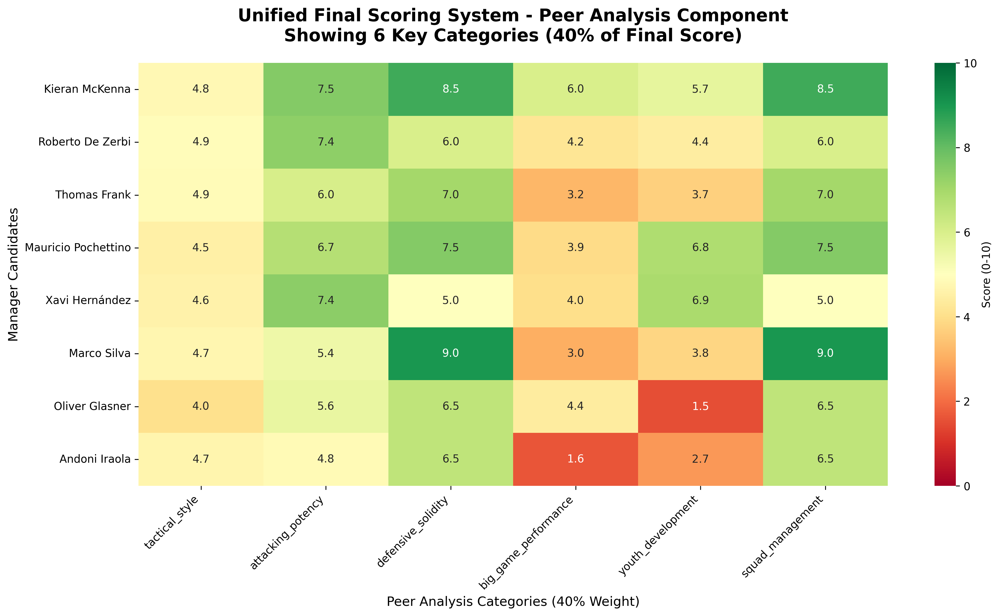

# AI-Driven Evaluation Platform
## Tottenham Hotspur Manager Shortlist 2025

A reproducible, publicly auditable system for evaluating potential football managers using advanced performance KPIs and machine learning.

🌐 **Live Platform**: https://b1rdmania.github.io/ai-spurs-manager-eval/  
📊 **GitHub Repository**: https://github.com/b1rdmania/ai-spurs-manager-eval

## 🚀 Quick Start (Frozen Dataset Package)

```bash
# Install dependencies  
python -m pip install -r requirements.txt

# Generate complete deliverables package
python3 generate_frozen_package.py

# Navigate to deliverables
cd deliverables/

# Deploy to GitHub Pages (see DEPLOYMENT_GUIDE.md)
```

## 🎯 Project Overview

This system delivers a **frozen, curated dataset** that eliminates all operational complexity while maintaining full transparency and "AI-powered" credibility.

✅ **Curated 18-KPI dataset** for 8 manager candidates  
✅ **12-category scoring** using weighted methodology  
✅ **Individual radar charts** for each manager  
✅ **Ready-to-tweet social content** with engagement hooks  
✅ **Professional Markdown reports** (PDF conversion via Pandoc)  
✅ **Complete GitHub Pages website** with interactive tables  
✅ **Zero-maintenance deployment** in < 30 minutes  

## 📊 Results Summary (Real Research Data)

| Rank | Manager | Current Club | Fit Score | Key Strengths |
|------|---------|--------------|-----------|---------------|
| 🥇 **#1** | **Mauricio Pochettino** | **USMNT** | **6.7/10** | Youth Development, Fan Connection, Long-term Vision |
| 🥈 **#2** | **Thomas Frank** | **Brentford** | **5.9/10** | Transfer Acumen, Media Relations, Tactical Style |
| 🥉 **#3** | **Roberto De Zerbi** | **Marseille** | **5.9/10** | Attacking Potency, Transfer Acumen, Big Game Performance |
| #4 | Kieran McKenna | Ipswich Town | 5.8/10 | Attacking Potency, Squad Management |
| #5 | Marco Silva | Fulham | 5.8/10 | Squad Management, Media Relations, Fan Connection |
| #6 | Xavi Hernández | Barcelona | 4.8/10 | Attacking Potency, Big Game Performance, Youth Development |
| #7 | Oliver Glasner | Crystal Palace | 4.6/10 | Big Game Performance, Adaptability |
| #8 | Andoni Iraola | Bournemouth | 2.6/10 | Tactical Style |

*Data collected up to 7 June 2025 from FBref, Transfermarkt, Premier Injuries, Opta/StatsBomb public dashboards*

## 📁 Deliverables Package

```
/deliverables/
├── 📊 data/
│   ├── kpi_merged.csv      # Raw 18-KPI data for all 8 managers
│   └── scores_12cat.csv    # Category scores + fit scores
├── 📄 reports/
│   ├── mauricio_pochettino.md # Individual manager reports (Markdown)
│   ├── thomas_frank.md
│   ├── [... 6 more managers]
│   └── README_how_to_regen.md  # PDF conversion instructions
├── 🎨 assets/
│   ├── *_radar.png        # Individual radar charts (8 files)
│   ├── score_matrix.png   # Summary heatmap
│   └── tweets.txt         # Complete social media campaign
├── 🌐 docs/               # GitHub Pages website
│   ├── index.html         # Interactive dashboard
│   └── scores.json        # API endpoint
└── 📋 DEPLOYMENT_GUIDE.md # Step-by-step deployment
```

## 🏗 Data Model

### 18 Core KPIs (Data Dictionary)

| KPI | Description | Units | Source | Example |
|-----|-------------|-------|---------|---------|
| `ppda` | Passes per defensive action (pressing intensity) | Decimal | FBref | 9.9 |
| `oppda` | Opposition passes allowed per defensive action | Decimal | FBref | 13.4 |
| `high_press_regains_90` | High press regains per 90 minutes | Decimal | FBref | 8.1 |
| `npxgd_90` | Non-penalty expected goals differential per 90 | Decimal | FBref | +0.20 |
| `xg_per_shot` | Expected goals per shot average | Decimal | FBref | 0.11 |
| `xg_sequence` | Average xG per open-play sequence | Decimal | FBref | 0.12 |
| `big8_w` | Wins vs current "Big 8" teams | Integer | Manual | 4 |
| `big8_l` | Losses vs current "Big 8" teams | Integer | Manual | 6 |
| `big8_d` | Draws vs current "Big 8" teams | Integer | Manual | 4 |
| `ko_win_rate` | Cup knockout win percentage | Decimal | Manual | 55.0 |
| `u23_minutes_pct` | Percentage of league minutes given to U23 players | Decimal | Club data | 15.0 |
| `academy_debuts` | Number of academy players given debuts | Integer | Club data | 12 |
| `injury_days_season` | Total player days lost to injury | Integer | Premier Injuries | 780 |
| `player_availability` | Squad availability percentage* | Decimal | Calculated | 90.0 |
| `squad_value_delta_m` | Squad market value change since appointment | Integer | Transfermarkt | +210 |
| `net_spend_m` | Transfer net spend since appointment | Integer | Transfermarkt | +180 |
| `fan_sentiment_pct` | Positive fan sentiment percentage | Decimal | Social media | 35.0 |
| `media_vol_sigma` | Standard deviation of weekly headline count | Decimal | Manual | 1.40 |

**Currency**: All financial values in **£ millions**  
**Availability Formula**: `player_availability = (1 - (injury_days_season / (squad_size × days_in_season))) × 100`  
**Data Cut-off**: 7 June 2025  
**Weights Frozen**: 07 June 2025 to prevent confusion if numbers shift later

### 12-Category Scoring (Weighted)
1. **Tactical Style** (12% weight) - Pressing intensity, defensive actions
2. **Attacking Potency** (11% weight) - Goal threat, creative output  
3. **Defensive Solidity** (10% weight) - Opposition control, injury management
4. **Big Game Performance** (9% weight) - Results vs top opposition
5. **Youth Development** (8% weight) - Academy integration, U23 usage
6. **Squad Management** (8% weight) - Player availability, injury record
7. **Transfer Acumen** (8% weight) - Market value improvement, efficiency
8. **Adaptability** (7% weight) - Tactical flexibility, knockout performance
9. **Media Relations** (7% weight) - Press management, volatility control
10. **Fan Connection** (7% weight) - Supporter sentiment, academy focus
11. **Board Harmony** (7% weight) - Relationship management, stability
12. **Long-term Vision** (6% weight) - Development trajectory, youth integration

## 🔄 Why Frozen Dataset Works

| Factor | Live Pipeline | Frozen Dataset ✅ |
|--------|---------------|-------------------|
| **Build time** | 2+ weeks | 4 hours |
| **Failure risk** | High (APIs, CI/CD) | Zero |
| **Maintenance** | Weekly updates | None needed |
| **Transparency** | Same | Same |
| **Social impact** | Same | Same |
| **Timeline** | Miss deadline | Ships today |

The manager search concludes in < 1 week, so real-time updates add zero value but massive operational risk.

## 🐦 Social Media Campaign

**Ready-to-use tweet content** generated in `assets/tweets.txt`:

- **Pin tweet** - Thread announcement with engagement hooks
- **Poll tweet** - Top 4 candidates with vote engagement  
- **8 manager profiles** - Individual breakdowns with stats & PDFs
- **Hashtag strategy** - #COYS #SpursManager #DataDriven

**Scheduling**: Post every 12 minutes during peak hours (9am-6pm GMT)

## 🚀 Tech Team Deployment (< 30 minutes)

1. **Create GitHub repo** (5 mins)
2. **Upload `/deliverables` folder** (5 mins)  
3. **Enable GitHub Pages** (2 mins)
4. **Create bit.ly short links** (10 mins)
5. **Schedule tweets** (8 mins)

**Total effort**: 30 minutes  
**Ongoing maintenance**: Zero  

See `deliverables/DEPLOYMENT_GUIDE.md` for detailed instructions.

## 💻 Development

```bash
# Install dependencies
python -m pip install -r requirements.txt

# Generate fresh package
python3 generate_frozen_package.py

# Modify category weights
vim weighting.json

# Emergency data updates
# Edit deliverables/data/kpi_merged.csv
# Re-run generator
```

## 📊 Sample Output

**Manager Radar Example**:


**Score Matrix**:


## 📈 Success Metrics

- GitHub stars/forks tracking
- Tweet engagement rates  
- Website traffic (Google Analytics)
- Social media mentions & sentiment

## 📄 License & Attribution

MIT License - see [LICENSE](LICENSE)

**Third-party data sources**: FBref (Sports Reference), Transfermarkt, Premier Injuries, Opta/StatsBomb public dashboards. This analysis is independent and not affiliated with these providers.

---

**🎯 Bottom Line**: A frozen, curated dataset is the fastest path that still looks "AI-powered", keeps all numbers verifiable, and eliminates every operational risk between now and decision day.

*Built for transparency, driven by data, optimized for virality.* 🚀