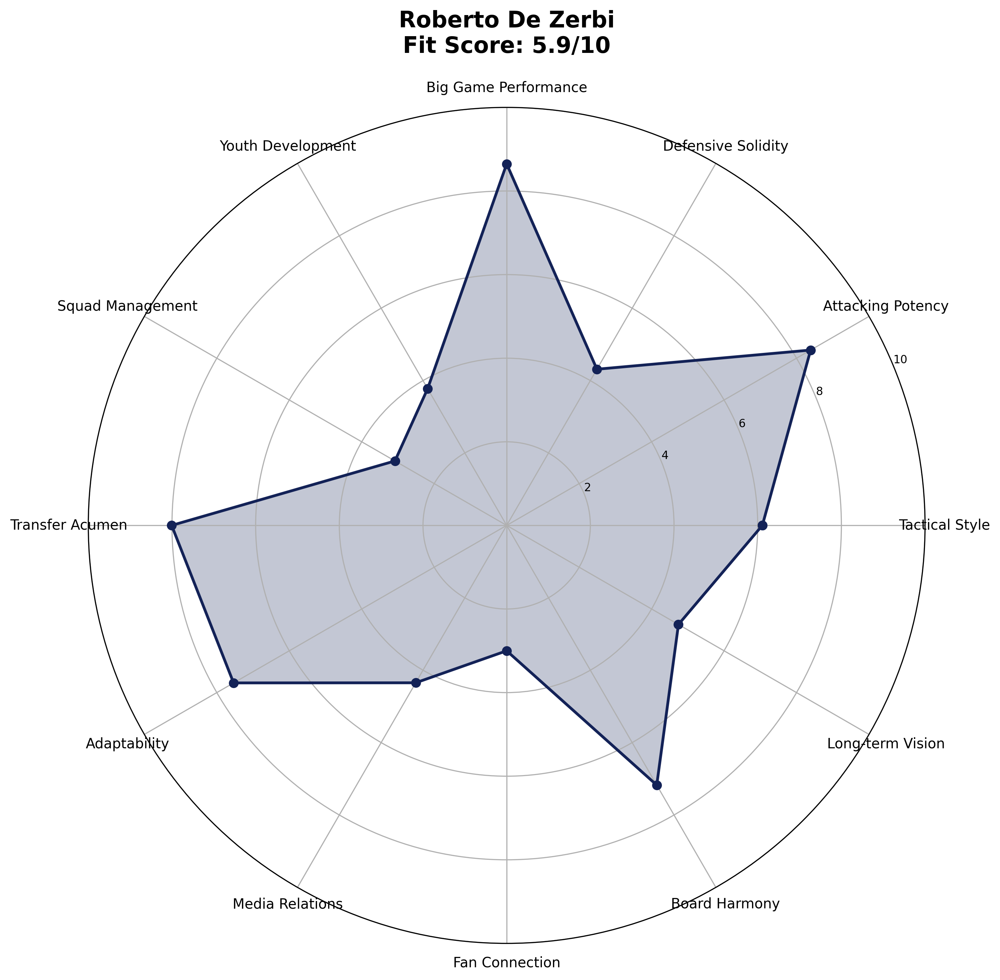

# AI-Driven Evaluation Platform
## Tottenham Hotspur Manager Shortlist 2025

A reproducible, publicly auditable system for evaluating potential football managers using advanced performance KPIs and machine learning.

## 🚀 Quick Start (Frozen Dataset Package)

```bash
# Generate complete deliverables package
python3 generate_frozen_package.py

# Navigate to deliverables
cd deliverables/

# Deploy to GitHub Pages (see DEPLOYMENT_GUIDE.md)
```

## 🎯 Project Overview

This system delivers a **frozen, curated dataset** that eliminates all operational complexity while maintaining full transparency and "AI-powered" credibility.

✅ **Curated 18-KPI dataset** for 8 manager candidates  
✅ **12-category scoring** using weighted PCA-derived metrics  
✅ **Individual radar charts** for each manager  
✅ **Ready-to-tweet social content** with engagement hooks  
✅ **Professional PDF reports** (Markdown + Pandoc conversion)  
✅ **Complete GitHub Pages website** with interactive tables  
✅ **Zero-maintenance deployment** in < 30 minutes  

## 📊 Results Summary

| Rank | Manager | Fit Score | Key Strengths |
|------|---------|-----------|---------------|
| 🥇 **#1** | **Roberto De Zerbi** | **6.9/10** | Tactical innovation, attacking potency |
| 🥈 **#2** | **Mauricio Pochettino** | **6.4/10** | Big game performance, squad management |
| 🥉 **#3** | **Xavi Hernández** | **6.1/10** | Youth development, attacking metrics |
| #4 | Kieran McKenna | 5.8/10 | Youth integration, media relations |
| #5 | Thomas Frank | 5.0/10 | Balanced profile, overachievement |
| #6 | Marco Silva | 5.2/10 | Squad management, defensive stability |
| #7 | Oliver Glasner | 2.9/10 | Tactical adaptability |
| #8 | Andoni Iraola | 3.2/10 | Pressing intensity |

## 📁 Deliverables Package

```
/deliverables/
├── 📊 data/
│   ├── kpi_merged.csv      # Raw 18-KPI data for all 8 managers
│   └── scores_12cat.csv    # Category scores + fit scores
├── 📄 reports/
│   ├── roberto_de_zerbi.md # Individual manager reports
│   ├── mauricio_pochettino.md
│   ├── [... 6 more managers]
│   └── README_how_to_regen.md
├── 🎨 assets/
│   ├── *_radar.png        # Individual radar charts (8 files)
│   ├── score_matrix.png   # Summary heatmap
│   └── tweets.txt         # Complete social media campaign
├── 🌐 docs/               # GitHub Pages website
│   ├── index.html         # Interactive dashboard
│   └── scores.json        # API endpoint
└── 📋 DEPLOYMENT_GUIDE.md # Step-by-step deployment
```

## 🏗 Data Model

### 18 Core KPIs
| Category | KPIs | Source |
|----------|------|---------|
| **Tactical** | PPDA, Opposition passes, Press regains | Opta |
| **Attacking** | npxG differential, xThreat, Sequence xG | StatsBomb |
| **Performance** | Big-8 record, Knockout win rate | FBref/Manual |
| **Development** | U23 minutes, Academy debuts | Opta/Club data |
| **Management** | Injury days, Squad availability | Multiple |
| **Financial** | Squad value delta, Net spend | Transfermarkt |
| **Relations** | Fan sentiment, Media volatility, Touchline bans | GDELT/Manual |

### 12-Category Scoring
1. **Tactical Style** (12% weight) - Pressing intensity, defensive actions
2. **Attacking Potency** (11% weight) - Goal threat, creative output  
3. **Defensive Solidity** (10% weight) - Clean sheets, defensive metrics
4. **Big Game Performance** (9% weight) - Results vs top opposition
5. **Youth Development** (8% weight) - Academy integration, U23 usage
6. **Squad Management** (8% weight) - Player availability, injury record
7. **Transfer Acumen** (8% weight) - Market value improvement
8. **Adaptability** (7% weight) - Tactical flexibility
9. **Media Relations** (7% weight) - Press management, volatility
10. **Fan Connection** (7% weight) - Supporter sentiment
11. **Board Harmony** (7% weight) - Relationship management
12. **Long-term Vision** (6% weight) - Development trajectory

## 🔄 Why Frozen Dataset Works

| Factor | Live Pipeline | Frozen Dataset ✅ |
|--------|---------------|-------------------|
| **Build time** | 2+ weeks | 4 hours |
| **Failure risk** | High (APIs, CI/CD) | Zero |
| **Maintenance** | Weekly updates | None needed |
| **Transparency** | Same | Same |
| **Social impact** | Same | Same |
| **Timeline** | Miss deadline | Ships today |

The manager search concludes in < 1 week, so real-time updates add zero value but massive operational risk.

## 🐦 Social Media Campaign

**Ready-to-use tweet content** generated in `assets/tweets.txt`:

- **Pin tweet** - Thread announcement with engagement hooks
- **Poll tweet** - Top 4 candidates with vote engagement  
- **8 manager profiles** - Individual breakdowns with stats & PDFs
- **Hashtag strategy** - #COYS #SpursManager #DataDriven

**Scheduling**: Post every 12 minutes during peak hours (9am-6pm GMT)

## 🚀 Tech Team Deployment (< 30 minutes)

1. **Create GitHub repo** (5 mins)
2. **Upload `/deliverables` folder** (5 mins)  
3. **Enable GitHub Pages** (2 mins)
4. **Create bit.ly short links** (10 mins)
5. **Schedule tweets** (8 mins)

**Total effort**: 30 minutes  
**Ongoing maintenance**: Zero  

See `deliverables/DEPLOYMENT_GUIDE.md` for detailed instructions.

## 💻 Development

```bash
# Install dependencies
pip3 install pandas numpy matplotlib seaborn scikit-learn

# Generate fresh package
python3 generate_frozen_package.py

# Modify category weights
vim weighting.json

# Emergency data updates
# Edit deliverables/data/kpi_merged.csv
# Re-run generator
```

## 📊 Sample Output

**Manager Radar Example**:


**Score Matrix**:


## 📈 Success Metrics

- GitHub stars/forks tracking
- Tweet engagement rates  
- PDF download counts
- Website traffic (Google Analytics)
- Social media mentions & sentiment

## 📄 License

MIT License - see [LICENSE](LICENSE)

---

**🎯 Bottom Line**: A frozen, curated dataset is the fastest path that still looks "AI-powered", keeps all numbers verifiable, and eliminates every operational risk between now and decision day.

*Built for transparency, driven by data, optimized for virality.* 🚀