# 🎯 Unified Final Scoring System - Computation Logic

## Mermaid Flowchart Diagram

```mermaid
flowchart TD
    A[Raw Manager Data] --> B[Data Sources]
    B --> C[FBref Stats]
    B --> D[Transfermarkt Data] 
    B --> E[Premier Injuries]
    B --> F[Manual Research]
    
    C --> G[Tactical Metrics]
    D --> H[Financial Data]
    E --> I[Squad Management]
    F --> J[Temperament Data]
    
    G --> K[12-Category Analysis]
    H --> K
    I --> K
    J --> K
    
    K --> L[Peer Score Calculation]
    L --> M[Normalize to 0-10 Scale]
    M --> N[Peer Score: 0-10]
    
    G --> O[Spurs-Fit Analysis]
    H --> O
    I --> O
    J --> O
    
    O --> P[Fit Index Calculation]
    O --> Q[Potential Index Calculation]
    
    P --> R[Front-Foot Play Check]
    P --> S[Youth Development Check]
    P --> T[Talent Inflation Check] 
    P --> U[Big Game Mentality Check]
    
    R --> V[Fit Index: 0-100]
    S --> V
    T --> V
    U --> V
    
    Q --> W[Age Factor Analysis]
    Q --> X[3-Year Trend Analysis]
    Q --> Y[Resource Leverage Analysis]
    Q --> Z[Temperament Analysis]
    
    W --> AA[Potential Index: 0-100]
    X --> AA
    Y --> AA
    Z --> AA
    
    V --> BB[Spurs-Fit Total]
    AA --> BB
    BB --> CC[Spurs-Fit Score: 0-100]
    
    N --> DD[Unified Final Calculation]
    CC --> DD
    
    DD --> EE[Peer Weight: 40%]
    DD --> FF[Spurs-Fit Weight: 60%]
    
    EE --> GG[Peer Component: Peer × 10 × 0.4]
    FF --> HH[Spurs-Fit Component: Spurs-Fit × 0.6]
    
    GG --> II[Final Score Combination]
    HH --> II
    
    II --> JJ[Final Score = Peer Component + Spurs-Fit Component]
    JJ --> KK[Final Score: 0-100]
    
    KK --> LL[Ranking by Final Score]
    LL --> MM[#1 Kieran McKenna: 79.5]
    LL --> NN[#2 Roberto De Zerbi: 75.6]
    LL --> OO[#3 Thomas Frank: 70.9]
    LL --> PP[#4 Mauricio Pochettino: 70.6]
    LL --> QQ[#5 Xavi Hernández: 63.7]
    LL --> RR[#6 Marco Silva: 60.7]
    LL --> SS[#7 Oliver Glasner: 55.6]
    LL --> TT[#8 Andoni Iraola: 51.8]
    
    style A fill:#132257,color:#fff
    style KK fill:#dc2626,color:#fff
    style MM fill:#28a745,color:#fff
    style NN fill:#17a2b8,color:#fff
    style OO fill:#ffc107,color:#000
```



## Detailed Computation Steps

### 1. **Data Input Phase**
- **Raw Manager Data**: 18 KPIs per manager
- **Multiple Sources**: FBref, Transfermarkt, Premier Injuries, Manual research
- **Time Period**: 3-year rolling window (2022-2025)

### 2. **Peer Score Calculation (40% Weight)**
```
For each of 12 categories:
1. Calculate raw metric for each manager
2. Normalize against peer group (0-10 scale)
3. Apply category weights
4. Sum weighted scores → Peer Score (0-10)
```

**Categories & Weights:**
- Tactical Style: 12%
- Attacking Potency: 11%  
- Defensive Solidity: 10%
- Big Game Performance: 9%
- Youth Development: 8%
- Squad Management: 8%
- Transfer Acumen: 8%
- Adaptability: 7%
- Media Relations: 7%
- Fan Connection: 7%
- Board Harmony: 7%
- Long Term Vision: 6%

### 3. **Spurs-Fit Score Calculation (60% Weight)**

#### **Fit Index (60% of Spurs-Fit)**
```
For each Spurs-specific benchmark:
- Front-Foot Play: PPDA ≤11, npxGD ≥0.10, xG/shot ≥0.11
- Youth Development: U23 minutes ≥15%, academy debuts ≥3  
- Talent Inflation: Squad value growth vs net spend efficiency
- Big Game Mentality: Top-8 performance and knockout success
→ Fit Index (0-100)
```

#### **Potential Index (40% of Spurs-Fit)**
```
Future-focused metrics:
- Age Factor: Younger = higher score (peak 38-42)
- 3-Year Trend: Performance trajectory analysis  
- Resource Leverage: Overperformance vs budget
- Temperament: Media stability + board relationships
→ Potential Index (0-100)
```

#### **Spurs-Fit Total**
```
Spurs-Fit Total = (Fit Index × 0.6) + (Potential Index × 0.4)
```

### 4. **Unified Final Score Formula**
```
Final Score = (Peer Score × 10 × 0.4) + (Spurs-Fit Score × 0.6)
Final Score = (Peer Component) + (Spurs-Fit Component)
Range: 0-100
```

### 5. **Example Calculation - Kieran McKenna**
```
Peer Score: 5.8/10
Spurs-Fit Score: 93.9/100

Peer Component = 5.8 × 10 × 0.4 = 23.2
Spurs-Fit Component = 93.9 × 0.6 = 56.34

Final Score = 23.2 + 56.34 = 79.54 → 79.5/100
Rank: #1
```

### 6. **Output & Ranking**
- Sort all managers by Final Score (descending)
- Generate ranks 1-8
- Create comprehensive reports and visualizations

---

**Formula Summary:**
```
Final Score = (40% × Peer Score × 10) + (60% × Spurs-Fit Score)
```

**Key Innovation:** Balances immediate managerial competence (peer analysis) with Spurs-specific cultural and tactical alignment (Spurs-Fit model) for optimal long-term decision making. 