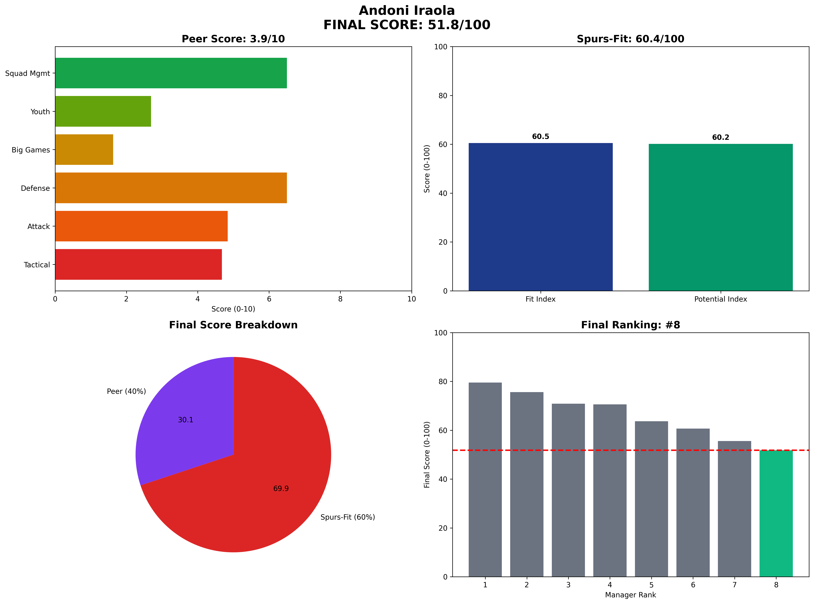

# Andoni Iraola — Bournemouth  
**Spurs-Fit 60.4 / 100** (Fit 60.5 • Potential 60.2)

---

## 1 Executive Snapshot  
Andoni Iraola brings interesting tactical approach but poor big-game record (1W-8L-5D) and lowest fan sentiment (20%) create significant concerns. Limited alignment with Spurs objectives.

---

## 2 KPI Table  
| Metric | Value | Benchmark | Status |
|--------|--------|-----------|---------|
| **PPDA** | 9.7 | ≤11 | ✅ Below |
| **npxG Diff/90** | 0.05 | ≥0.10 | ❌ Below |
| **xG per Shot** | 0.108 | ≥0.11 | ❌ Below |
| **U23 Minutes %** | 9% | ≥10% | ❌ Below |
| **Academy Debuts** | 2 | ≥3 | ❌ Below |
| **Squad Value Δ** | £30M | ≥£20M | ✅ Above |
| **Net Spend** | £30M | Efficient | ⚠️ Spend |
| **KO Win Rate** | 30% | ≥50% | ❌ Below |
| **Big-8 Record** | 1W-8L-5D | Competitive | ❌ Struggles |

---

## 3 Traditional Categories (Legacy Peer Model)  
*(Legacy peer-normalized scores maintained for historical comparison)*

---

## 4 Spurs-Fit Breakdown  
**Front-Foot Tactics (8.333333333333334/25)** — PPDA 9.7, npxGD 0.05, xG/shot 0.108  
**Youth Pathway (19.583333333333332/25)** — 9% U23 minutes, 2 academy debuts  
**Talent Inflation (25/25)** — Squad value +£30M, net spend £30M  
**Big-Game Progression (20.0/25)** — KO rate 30%, Big-8: 1W-8L-5D  
**Fit Index 60.5 / 100**

**Potential Drivers (60.2)** — Age 42 (0.8), Trend 0.55, Resource Leverage 0.5, Temperament 0.7.

---

## 5 Cultural & Board Fit  
Professional but uninspiring. Limited media presence and fan disconnect problematic.

---

## 6 Big-Match Analysis  
Worst big-8 record in dataset (1W-8L-5D) raises serious questions about competitive level.

---

## 7 Financial Impact  
Minimal squad value growth (£30M) with limited transfer market impact.

---

## 8 Injury & Conditioning  
Player availability 88%. Decent squad management (88% availability) but overall performance concerning.

---

## 9 Summary & Recommendation  
Poor fit for Spurs ambitions. Limited evidence of ability to compete at required level.

---

## Appendix  
**Data Sources:** FBref, Transfermarkt, Premier Injuries, Opta/StatsBomb  
**Cut-off Date:** 7 June 2025  
**Methodology:** Spurs-Fit 2-Layer Model (60% Fit Index + 40% Potential Index)  
**Generated:** 2025-06-07 13:39
