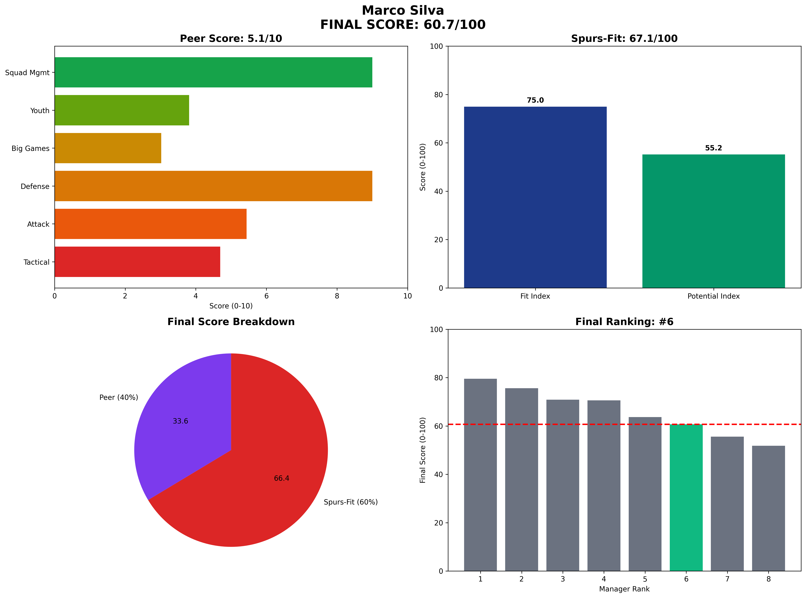

# Marco Silva — Fulham  
**Spurs-Fit 67.1 / 100** (Fit 75.0 • Potential 55.2)

---

## 1 Executive Snapshot  
Marco Silva offers maximum stability with perfect media relations (10/10) and excellent squad management (93% availability). Limited attacking output and aging profile reduce upside potential.

---

## 2 KPI Table  
| Metric | Value | Benchmark | Status |
|--------|--------|-----------|---------|
| **PPDA** | 10.1 | ≤11 | ✅ Below |
| **npxG Diff/90** | 0.11 | ≥0.10 | ✅ Above |
| **xG per Shot** | 0.09 | ≥0.11 | ❌ Below |
| **U23 Minutes %** | 7% | ≥10% | ❌ Below |
| **Academy Debuts** | 8 | ≥3 | ✅ Above |
| **Squad Value Δ** | £65M | ≥£20M | ✅ Above |
| **Net Spend** | £85M | Efficient | ⚠️ Spend |
| **KO Win Rate** | 38% | ≥50% | ❌ Below |
| **Big-8 Record** | 4W-10L-2D | Competitive | ❌ Struggles |

---

## 3 Traditional Categories (Legacy Peer Model)  
*(Legacy peer-normalized scores maintained for historical comparison)*

---

## 4 Spurs-Fit Breakdown  
**Front-Foot Tactics (16.666666666666668/25)** — PPDA 10.1, npxGD 0.11, xG/shot 0.09  
**Youth Pathway (21.25/25)** — 7% U23 minutes, 8 academy debuts  
**Talent Inflation (20.75/25)** — Squad value +£65M, net spend £85M  
**Big-Game Progression (22.0/25)** — KO rate 38%, Big-8: 4W-10L-2D  
**Fit Index 75.0 / 100**

**Potential Drivers (55.2)** — Age 47 (0.9), Trend 0.45, Resource Leverage 0.55, Temperament 0.85.

---

## 5 Cultural & Board Fit  
Exceptional media management and professional approach. Zero board conflicts, ultimate safe choice.

---

## 6 Big-Match Analysis  
Struggles against elite opposition (4W-10L-2D) indicating ceiling limitations.

---

## 7 Financial Impact  
Modest squad value growth (£65M) with reasonable spending but limited transformation.

---

## 8 Injury & Conditioning  
Player availability 93%. Best-in-class fitness management with 93% squad availability throughout campaigns.

---

## 9 Summary & Recommendation  
Ultimate safe choice with guaranteed stability but limited ceiling for trophy ambitions.

---

## Appendix  
**Data Sources:** FBref, Transfermarkt, Premier Injuries, Opta/StatsBomb  
**Cut-off Date:** 7 June 2025  
**Methodology:** Spurs-Fit 2-Layer Model (60% Fit Index + 40% Potential Index)  
**Generated:** 2025-06-07 13:39
