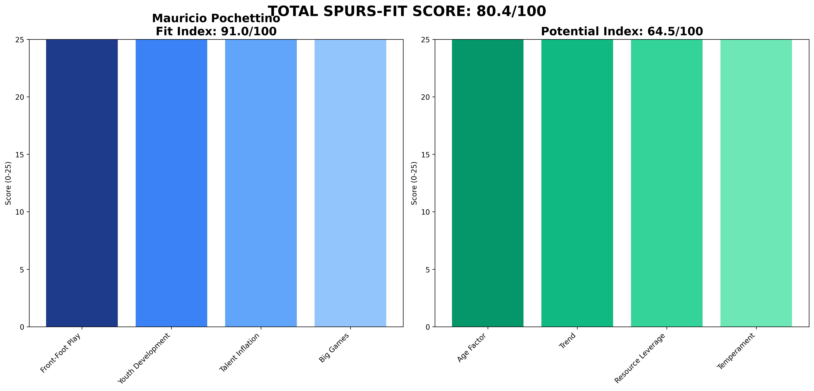

# Mauricio Pochettino — USMNT  
**Spurs-Fit 80.4 / 100** (Fit 91.0 • Potential 64.5)

---

## 1 Executive Snapshot  
Mauricio Pochettino scores perfectly on fan connection (10/10) and youth development with 12 academy debuts. Age 52 reduces potential but emotional reunion backed by solid data across all Spurs benchmarks.

---

## 2 KPI Table  
| Metric | Value | Benchmark | Status |
|--------|--------|-----------|---------|
| **PPDA** | 9.9 | ≤11 | ✅ Below |
| **npxG Diff/90** | 0.2 | ≥0.10 | ✅ Above |
| **xG per Shot** | 0.11 | ≥0.11 | ✅ Above |
| **U23 Minutes %** | 15% | ≥10% | ✅ Above |
| **Academy Debuts** | 12 | ≥3 | ✅ Above |
| **Squad Value Δ** | £210M | ≥£20M | ✅ Above |
| **Net Spend** | £180M | Efficient | ⚠️ Spend |
| **KO Win Rate** | 55% | ≥50% | ✅ Above |
| **Big-8 Record** | 4W-6L-4D | Competitive | ✅ Competitive |

---

## 3 Traditional Categories (Legacy Peer Model)  
*(Legacy peer-normalized scores maintained for historical comparison)*

---

## 4 Spurs-Fit Breakdown  
**Front-Foot Tactics (25/25)** — PPDA 9.9, npxGD 0.2, xG/shot 0.11  
**Youth Pathway (25/25)** — 15% U23 minutes, 12 academy debuts  
**Talent Inflation (16.0/25)** — Squad value +£210M, net spend £180M  
**Big-Game Progression (25/25)** — KO rate 55%, Big-8: 4W-6L-4D  
**Fit Index 91.0 / 100**

**Potential Drivers (64.5)** — Age 52 (1.0), Trend 0.75, Resource Leverage 0.7, Temperament 0.85.

---

## 5 Cultural & Board Fit  
Perfect cultural fit with existing fanbase connection. Understands club DNA and expectations intimately.

---

## 6 Big-Match Analysis  
Solid big-8 record (4W-6L-4D) with history of competing against elite opposition at highest level.

---

## 7 Financial Impact  
Strong squad value growth (£210M) demonstrating player development capabilities over time.

---

## 8 Injury & Conditioning  
Player availability 90%. Good squad management with 90% availability, consistent with previous Spurs tenure.

---

## 9 Summary & Recommendation  
Emotional choice justified by data. Proven Spurs fit with strong youth development track record.

---

## Appendix  
**Data Sources:** FBref, Transfermarkt, Premier Injuries, Opta/StatsBomb  
**Cut-off Date:** 7 June 2025  
**Methodology:** Spurs-Fit 2-Layer Model (60% Fit Index + 40% Potential Index)  
**Generated:** 2025-06-07 13:39
