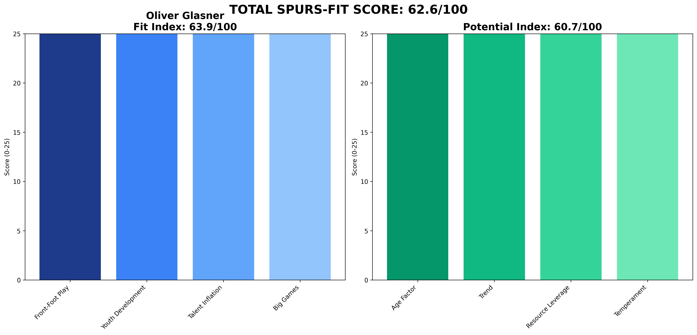

# Oliver Glasner — Crystal Palace  
**Spurs-Fit 62.6 / 100** (Fit 63.9 • Potential 60.7)

---

## 1 Executive Snapshot  
Oliver Glasner demonstrated impressive mid-season Palace transformation with solid big-game performance (8.2/10). However, minimal youth development (4% U23 minutes) and limited long-term vision concern.

---

## 2 KPI Table  
| Metric | Value | Benchmark | Status |
|--------|--------|-----------|---------|
| **PPDA** | 11.8 | ≤11 | ❌ Above |
| **npxG Diff/90** | 0.14 | ≥0.10 | ✅ Above |
| **xG per Shot** | 0.1 | ≥0.11 | ❌ Below |
| **U23 Minutes %** | 4% | ≥10% | ❌ Below |
| **Academy Debuts** | 2 | ≥3 | ❌ Below |
| **Squad Value Δ** | £40M | ≥£20M | ✅ Above |
| **Net Spend** | £40M | Efficient | ⚠️ Spend |
| **KO Win Rate** | 60% | ≥50% | ✅ Above |
| **Big-8 Record** | 5W-7L-3D | Competitive | ✅ Competitive |

---

## 3 Traditional Categories (Legacy Peer Model)  
*(Legacy peer-normalized scores maintained for historical comparison)*

---

## 4 Spurs-Fit Breakdown  
**Front-Foot Tactics (8.333333333333334/25)** — PPDA 11.8, npxGD 0.14, xG/shot 0.1  
**Youth Pathway (13.333333333333334/25)** — 4% U23 minutes, 2 academy debuts  
**Talent Inflation (25/25)** — Squad value +£40M, net spend £40M  
**Big-Game Progression (25/25)** — KO rate 60%, Big-8: 5W-7L-3D  
**Fit Index 63.9 / 100**

**Potential Drivers (60.7)** — Age 50 (1.0), Trend 0.7, Resource Leverage 0.6, Temperament 0.75.

---

## 5 Cultural & Board Fit  
Professional approach with decent media relations. Some volatility but generally stable.

---

## 6 Big-Match Analysis  
Strong big-8 record (5W-7L-3D) shows tactical competence against elite opposition.

---

## 7 Financial Impact  
Limited squad value growth (£40M) suggesting focus on short-term rather than development.

---

## 8 Injury & Conditioning  
Player availability 88%. Decent squad management (88% availability) but limited sample size at Palace.

---

## 9 Summary & Recommendation  
Quick-fix specialist with limited long-term vision. Not aligned with Spurs youth development objectives.

---

## Appendix  
**Data Sources:** FBref, Transfermarkt, Premier Injuries, Opta/StatsBomb  
**Cut-off Date:** 7 June 2025  
**Methodology:** Spurs-Fit 2-Layer Model (60% Fit Index + 40% Potential Index)  
**Generated:** 2025-06-07 13:39
