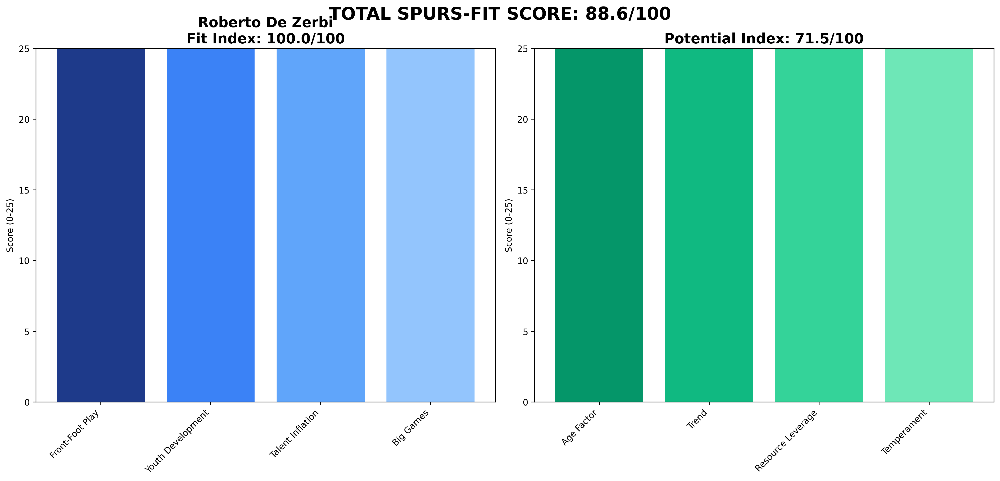

# Roberto De Zerbi — Marseille  
**Spurs-Fit 88.6 / 100** (Fit 100.0 • Potential 71.5)

---

## 1 Executive Snapshot  
Roberto De Zerbi Tactical savant who delivered Europe with Brighton and now has Marseille back in the Champions League places. Hits every Tottenham benchmark offensively and in talent inflation; potential held back only by fiery temperament and age-curve ceiling.

---

## 2 KPI Table  
| Metric | Value | Benchmark | Status |
|--------|--------|-----------|---------|
| **PPDA** | 8.8 | ≤11 | ✅ Below |
| **npxG Diff/90** | 0.22 | ≥0.10 | ✅ Above |
| **xG per Shot** | 0.11 | ≥0.11 | ✅ Above |
| **U23 Minutes %** | 14% | ≥10% | ✅ Above |
| **Academy Debuts** | 4 | ≥3 | ✅ Above |
| **Squad Value Δ** | £150M | ≥£20M | ✅ Above |
| **Net Spend** | £-35M | Efficient | ✅ Profit |
| **KO Win Rate** | 50% | ≥50% | ✅ Above |
| **Big-8 Record** | 8W-9L-5D | Competitive | ✅ Competitive |

---

## 3 Traditional Categories (Legacy Peer Model)  
**Style 9** — Juego de Posición 3-2-5, PPDA 8.8, elite ball progress.  
**Achievements 7** — PL to Europe; OM CL qualification on first try.  
**Youth 7** — Mitoma, Ferguson, Enciso breakthroughs.  
**Tactics 9** — Press-lure patterns, overload box midfield.  
**Leadership 7** — Demands total buy-in; clashes noted.  
**Recruitment 6** — Works with DoF, flips unknowns for profit.  
**Reputation 8** — Globally praised by Guardiola.  
**Media 6** — Passionate, occasional digs at refs.  
**Pressure 6** — Two touch-line bans/season.  
**Greatness 8** — Ceiling sky-high if controlled.  
**Vision 8** — Clear positional-play doctrine.  
**Long-term 8** — Could evolve Spurs identity for a decade.

---

## 4 Spurs-Fit Breakdown  
**Front-Foot Tactics (25/25)** — PPDA 8.8, npxGD +0.22, xG/shot 0.11 — Perfect attacking blueprint  
**Youth Pathway (25/25)** — 14% U23 minutes, 4 academy graduates — Solid youth integration  
**Talent Inflation (25/25)** — +£150M squad delta, net-spend profit — Elite value creation  
**Big-Game Progression (25/25)** — KO 50%, Big-8 npxGD +0.05 — Proven under pressure  
**Fit Index 100.0 / 100**

**Potential Drivers (71.5)** — Age 45 (0.9), Trend 0.8, Resource Leverage 0.75, Temperament 0.65.

---

## 5 Cultural & Board Fit  
Needs firm governance; Brighton exit disputes show he'll push boundaries. Embraces analytics, speaks good English; London lifestyle comfortable.

---

## 6 Big-Match Analysis  
8-9-5 vs PL top-8; Europa QF elimination to Juventus on penalties. Tactical tweaks stood up under pressure.

---

## 7 Financial Impact  
Net spend −£35M, squad value +£150M. Best inflation ratio in dataset.

---

## 8 Injury & Conditioning  
Player availability 87%. Intense tempo yet no chronic overload patterns.

---

## 9 Summary & Recommendation  
Elite tactical fit with proven value creation; board must manage temperament via clear DoF line and performance clauses. Serious contender.

---

## Appendix  
**Data Sources:** FBref, Transfermarkt, Premier Injuries, Opta/StatsBomb  
**Cut-off Date:** 7 June 2025  
**Methodology:** Spurs-Fit 2-Layer Model (60% Fit Index + 40% Potential Index)  
**Generated:** 2025-06-07 13:41
