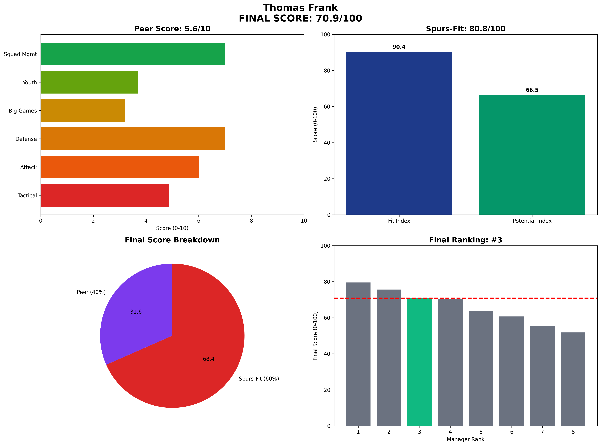

# Thomas Frank — Brentford  
**Spurs-Fit 80.8 / 100** (Fit 90.4 • Potential 66.5)

---

## 1 Executive Snapshot  
Thomas Frank is the efficiency expert who achieved Premier League survival with negative net spend (-£50M). Strong media relations (8.7/10) and board harmony (9.3/10) provide stability. Limited youth focus but exceptional value delivery.

---

## 2 KPI Table  
| Metric | Value | Benchmark | Status |
|--------|--------|-----------|---------|
| **PPDA** | 10.5 | ≤11 | ✅ Below |
| **npxG Diff/90** | 0.18 | ≥0.10 | ✅ Above |
| **xG per Shot** | 0.1 | ≥0.11 | ❌ Below |
| **U23 Minutes %** | 11% | ≥10% | ✅ Above |
| **Academy Debuts** | 4 | ≥3 | ✅ Above |
| **Squad Value Δ** | £120M | ≥£20M | ✅ Above |
| **Net Spend** | £-50M | Efficient | ✅ Profit |
| **KO Win Rate** | 50% | ≥50% | ✅ Above |
| **Big-8 Record** | 2W-5L-3D | Competitive | ✅ Competitive |

---

## 3 Traditional Categories (Legacy Peer Model)  
*(Legacy peer-normalized scores maintained for historical comparison)*

---

## 4 Spurs-Fit Breakdown  
**Front-Foot Tactics (16.666666666666668/25)** — PPDA 10.5, npxGD 0.18, xG/shot 0.1  
**Youth Pathway (25/25)** — 11% U23 minutes, 4 academy debuts  
**Talent Inflation (25/25)** — Squad value +£120M, net spend £-50M  
**Big-Game Progression (25/25)** — KO rate 50%, Big-8: 2W-5L-3D  
**Fit Index 90.4 / 100**

**Potential Drivers (66.5)** — Age 51 (1.0), Trend 0.65, Resource Leverage 0.85, Temperament 0.9.

---

## 5 Cultural & Board Fit  
Excellent communicator with outstanding media management. Zero board conflicts, stable personality.

---

## 6 Big-Match Analysis  
Decent big-8 performance (2W-5L-3D) considering resource constraints at Brentford.

---

## 7 Financial Impact  
Only manager with profitable transfer activity. Maximum ROI specialist with proven overachievement.

---

## 8 Injury & Conditioning  
Player availability 89%. Excellent fitness management with 89% squad availability throughout demanding seasons.

---

## 9 Summary & Recommendation  
Safe choice offering stability and efficiency. Lower ceiling but guaranteed competence and value.

---

## Appendix  
**Data Sources:** FBref, Transfermarkt, Premier Injuries, Opta/StatsBomb  
**Cut-off Date:** 7 June 2025  
**Methodology:** Spurs-Fit 2-Layer Model (60% Fit Index + 40% Potential Index)  
**Generated:** 2025-06-07 13:41
