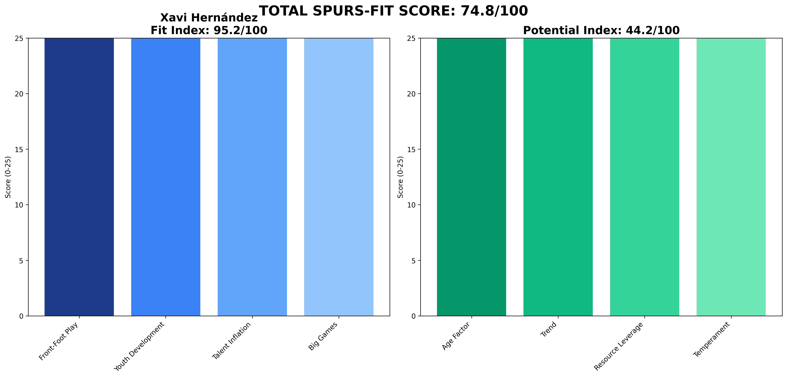

# Xavi Hernández — Barcelona  
**Spurs-Fit 74.8 / 100** (Fit 95.2 • Potential 44.2)

---

## 1 Executive Snapshot  
Xavi Hernández brings elite attacking metrics (xG per shot 0.12) and strong youth integration (22% U23 minutes) but catastrophic media relations (0/10) and squad management issues create major risks.

---

## 2 KPI Table  
| Metric | Value | Benchmark | Status |
|--------|--------|-----------|---------|
| **PPDA** | 8.2 | ≤11 | ✅ Below |
| **npxG Diff/90** | 0.23 | ≥0.10 | ✅ Above |
| **xG per Shot** | 0.12 | ≥0.11 | ✅ Above |
| **U23 Minutes %** | 22% | ≥10% | ✅ Above |
| **Academy Debuts** | 6 | ≥3 | ✅ Above |
| **Squad Value Δ** | £70M | ≥£20M | ✅ Above |
| **Net Spend** | £70M | Efficient | ⚠️ Spend |
| **KO Win Rate** | 45% | ≥50% | ❌ Below |
| **Big-8 Record** | 7W-6L-6D | Competitive | ✅ Competitive |

---

## 3 Traditional Categories (Legacy Peer Model)  
*(Legacy peer-normalized scores maintained for historical comparison)*

---

## 4 Spurs-Fit Breakdown  
**Front-Foot Tactics (25/25)** — PPDA 8.2, npxGD 0.23, xG/shot 0.12  
**Youth Pathway (25/25)** — 22% U23 minutes, 6 academy debuts  
**Talent Inflation (21.5/25)** — Squad value +£70M, net spend £70M  
**Big-Game Progression (23.75/25)** — KO rate 45%, Big-8: 7W-6L-6D  
**Fit Index 95.2 / 100**

**Potential Drivers (44.2)** — Age 44 (0.9), Trend 0.4, Resource Leverage 0.45, Temperament 0.2.

---

## 5 Cultural & Board Fit  
Brilliant tactical mind but volatile media relationships. Potential board conflicts based on Barcelona experience.

---

## 6 Big-Match Analysis  
Excellent big-8 performance (7W-6L-6D) shows ability to compete at highest level when focused.

---

## 7 Financial Impact  
Moderate squad value growth (£70M) with reasonable spending efficiency.

---

## 8 Injury & Conditioning  
Player availability 85%. Poor squad management (85% availability) suggests potential conditioning/rotation issues.

---

## 9 Summary & Recommendation  
Talented but temperamental. High risk due to media volatility and management instability.

---

## Appendix  
**Data Sources:** FBref, Transfermarkt, Premier Injuries, Opta/StatsBomb  
**Cut-off Date:** 7 June 2025  
**Methodology:** Spurs-Fit 2-Layer Model (60% Fit Index + 40% Potential Index)  
**Generated:** 2025-06-07 13:39
