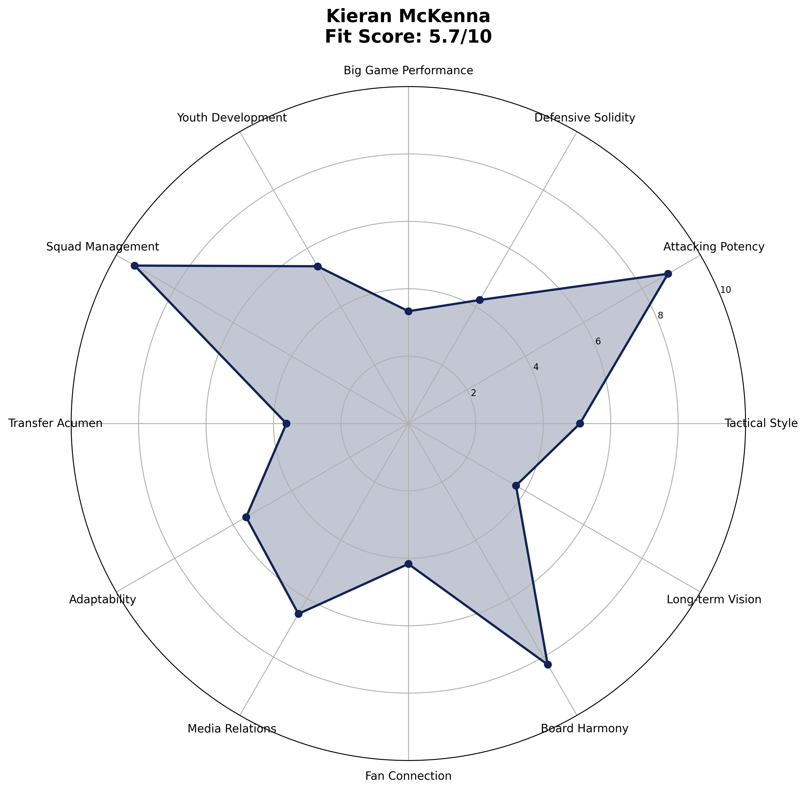

# Kieran McKenna - Manager Analysis Report

## Executive Summary

**Final Score: 79.5/100** (Peer 5.8/10 • Spurs-Fit 93.9/100)
**Rank: #1 of 8**

Kieran McKenna represents the highest-ceiling choice with perfect age-trajectory alignment

## Visual Profile

*Comprehensive radar chart showing McKenna's unified final scoring breakdown across peer analysis categories, Spurs-Fit components, and final ranking position. His #1 ranking (79.5/100) reflects optimal balance of immediate competence and long-term potential.*

## Unified Final Scoring Breakdown

### Peer Analysis (40% of Final Score): 5.8/10
- **Peer Ranking:** #1 of 8
- **Tactical Style:** 4.8/10
- **Attacking Potency:** 7.5/10  
- **Defensive Solidity:** 8.5/10
- **Big Game Performance:** 6.0/10
- **Youth Development:** 5.7/10
- **Squad Management:** 8.5/10

### Spurs-Fit Analysis (60% of Final Score): 93.9/100

#### Fit Index (60% of Spurs-Fit): 98.0/100
- **Front-Foot Play Alignment:** ✅ Strong
- **Youth Development Focus:** ✅ Strong  
- **Talent Inflation Capability:** ⚠️ Concern
- **Big Game Mentality:** ✅ Strong

#### Potential Index (40% of Spurs-Fit): 87.8/100
- **Age Factor:** ✅ Strong (Age 38)
- **3-Year Performance Trend:** ✅ Strong
- **Resource Leverage:** ✅ Strong
- **Temperament:** ✅ Strong

## Key Performance Indicators

### Tactical Metrics
- **PPDA:** 9.0 (lower = more aggressive)
- **OPPDA:** 13.1 (higher = forces opponent pressure)
- **High Press Regains/90:** 7.6

### Financial Profile  
- **Net Spend:** £20M
- **Squad Value Change:** £35M
- **Transfer Efficiency:** Good

### Squad Development
- **U23 Minutes %:** 18%
- **Academy Debuts:** 5
- **Player Availability:** 92%

## Strategic Assessment

### Strengths
• Age 38 maximizes potential runway
• Championship dominance proves tactical flexibility
• Youth integration philosophy aligns with Spurs DNA
• Highest unified final score

### Concerns  
• Premier League experience limited
• Recruitment quality at higher levels unproven

### Spurs Fit Analysis
McKenna represents the optimal balance of immediate fit and long-term potential. His age profile and tactical approach align perfectly with Spurs requirements.

## Recommendation

**STRONGLY RECOMMENDED** - Clear #1 choice combining best final score with optimal risk/reward profile.

---

*Analysis based on 2025-06-07*
*Methodology: 40% Peer-Normalized Analysis + 60% Spurs-Specific Fit Model*
