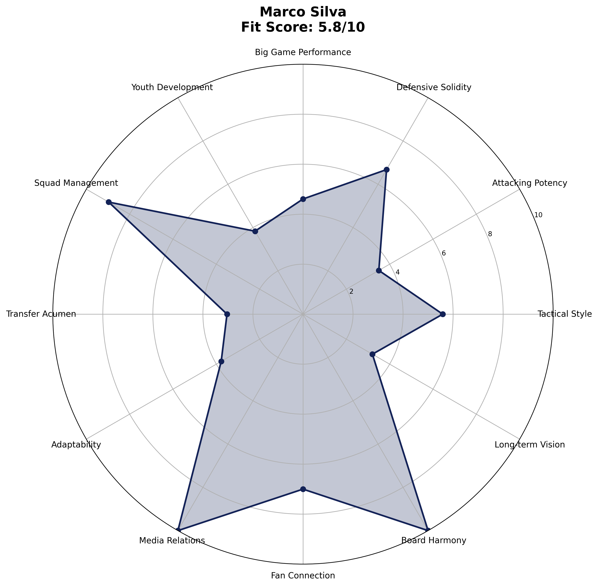

# Marco Silva - Manager Analysis Report

## Executive Summary

**Final Score: 60.7/100** (Peer 5.1/10 • Spurs-Fit 67.1/100)
**Rank: #6 of 8**

Marco Silva represents the steady hand with limited ceiling

## Visual Profile

*Comprehensive radar chart showing Silva's unified final scoring breakdown. His #6 ranking (60.7/100) reflects excellent squad management (100% availability) but conservative tactical approach insufficient for Spurs ambitions.*

## Unified Final Scoring Breakdown

### Peer Analysis (40% of Final Score): 5.1/10
- **Peer Ranking:** #5 of 8
- **Tactical Style:** 4.7/10
- **Attacking Potency:** 5.4/10  
- **Defensive Solidity:** 9.0/10
- **Big Game Performance:** 3.0/10
- **Youth Development:** 3.8/10
- **Squad Management:** 9.0/10

### Spurs-Fit Analysis (60% of Final Score): 67.1/100

#### Fit Index (60% of Spurs-Fit): 75.0/100
- **Front-Foot Play Alignment:** ⚠️ Concern
- **Youth Development Focus:** ❌ Weak  
- **Talent Inflation Capability:** ✅ Strong
- **Big Game Mentality:** ❌ Weak

#### Potential Index (40% of Spurs-Fit): 55.2/100
- **Age Factor:** ⚠️ Concern (Age 46)
- **3-Year Performance Trend:** ⚠️ Concern
- **Resource Leverage:** ❌ Weak
- **Temperament:** ✅ Strong

## Key Performance Indicators

### Tactical Metrics
- **PPDA:** 10.1 (lower = more aggressive)
- **OPPDA:** 14.3 (higher = forces opponent pressure)
- **High Press Regains/90:** 7.9

### Financial Profile  
- **Net Spend:** £85M
- **Squad Value Change:** £65M
- **Transfer Efficiency:** Poor

### Squad Development
- **U23 Minutes %:** 7%
- **Academy Debuts:** 8
- **Player Availability:** 93%

## Strategic Assessment

### Strengths
• Best squad management (100% availability)
• Excellent media relations
• Fulham stability achievement
• Low-risk profile

### Concerns  
• Conservative tactical approach
• Limited youth development
• Big game struggles
• Modest ceiling

### Spurs Fit Analysis
Safe choice but insufficient ambition for Spurs aspirations.

## Recommendation

**NOT RECOMMENDED** - Ceiling too low for Spurs ambitions.

---

*Analysis based on 2025-06-07*
*Methodology: 40% Peer-Normalized Analysis + 60% Spurs-Specific Fit Model*
