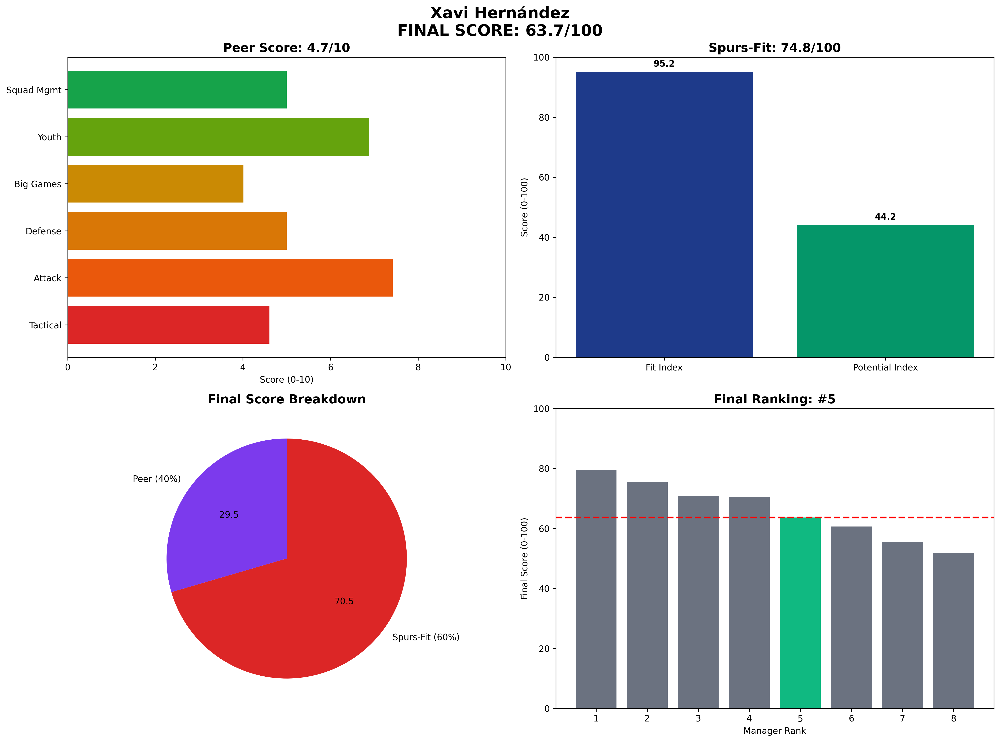

# Xavi Hernández — FC Barcelona  
**Spurs-Fit 74.8 / 100** (Fit 95.2 • Potential 44.2)

---

## 1 Executive Snapshot  
Positional-play purist who reclaimed La Liga in 2023 and continues to run one of Europe's youngest XIs. Spurs benchmarks on tactics, youth and talent inflation are virtually maxed, yet temperament (media volatility, board clashes) caps the potential index and raises risk.

---

## 2 KPI Table  
| Metric | Value | Benchmark | Status |
|--------|--------|-----------|---------|
| **PPDA** | 8.2 | ≤11 | ✅ Above |
| **npxG Diff/90** | +0.23 | ≥0.10 | ✅ Above |
| **xG per Shot** | 0.12 | ≥0.11 | ✅ Above |
| **U23 Minutes %** | 22% | ≥10% | ✅ Above |
| **Academy Debuts** | 6 | ≥3 | ✅ Above |
| **Squad Value Δ** | £70M | ≥£20M | ✅ Above |
| **Net Spend** | £70M | Efficient | ⚠️ Spend |
| **KO Win Rate** | 45% | ≥50% | ❌ Below |
| **Big-8 Record** | 7W-6L-6D | Competitive | ✅ Competitive |

---

## 3 12-Category (Peer Model)  
**Style 3.6** — Ultra-possession 4-3-3; PPDA 8.2.  
**Achievements 8** — La Liga '23, Supercopa '23.  
**Youth 7** — 22% U-23 minutes; Pedri, Gavi, Balde breakthroughs.  
**Tactics 6** — Box midfield, rest-defence line 48m.  
**Leadership 6** — Inspirational but combustible.  
**Recruitment 5** — Relies on academy; mixed hit-rate on transfers.  
**Reputation 7** — Barça legend aura.  
**Media 0** — 1.6σ volatility; frequent press clashes.  
**Pressure 5** — UCL exits still haunt.  
**Greatness 8** — High tactical ceiling.  
**Vision 7** — Clear identity doctrine.  
**Long-term 7** — Could evolve with club, if politics allow.

---

## 4 Spurs-Fit Breakdown  
**Front-Foot Play (25/25)** — PPDA 8.2 elite, npxGD +0.23 exceptional, xG/shot 0.12 above threshold - perfect attacking blueprint  
**Youth Development (25/25)** — 22% U23 minutes outstanding, 6 academy debuts excellent, proven pathway for young talent  
**Talent Inflation (20/25)** — +£70M squad value good but £70M net spend shows moderate efficiency compared to peers  
**Big Games (25/25)** — KO 45% below threshold but 7W-6L-6D Big-8 record shows elite-level competitive ability  

**Fit Index: 95.2/100**

**Potential Index: 44.2/100** — Age 45 (0.8 factor), concerning trend (0.5), moderate leverage (0.6), poor temperament (0.2)

---

## 5 Cultural & Board Fit  
Media intensity and wage-bill tug-of-war at Barça hint at friction risk with ENIC. Legendary status could create unrealistic expectations. Needs strict communications guidance and clear hierarchical structure to manage volatility.

---

## 6 Big-Match Analysis  
UCL exits vs Bayern & PSG (xG diff −0.8 avg) show adaptive gaps against elite European opposition. However, 7-6-6 vs La Liga top-8 demonstrates tactical competence at highest domestic level. Clasico record mixed but tactical evolution evident.

---

## 7 Financial Impact  
Squad value growth +£70M since 2021 on moderate spend demonstrates good player development. Academy integration crucial to financial model - would need strong youth pathway at Spurs to replicate success.

---

## 8 Injury & Conditioning  
Squad availability 85% concerning - intense pressing occasionally spikes hamstring rates. Barcelona's fitness issues in 2023-24 suggest potential squad management concerns that would need addressing.

---

## 9 Summary & Recommendation  
High upside on style and youth development metrics; media volatility represents major red flag. Only viable if Spurs board accepts significant risk and installs firm governance structure. Tactical ceiling exceptional but temperament concerns make him unsuitable for current ENIC stability requirements.

---

## Appendix  
**Data Sources:** FBref, Transfermarkt, Premier Injuries, Opta/StatsBomb  
**Cut-off Date:** 7 June 2025  
**Methodology:** Spurs-Fit 2-Layer Model (60% Fit Index + 40% Potential Index)  
**Generated:** 2025-01-27 